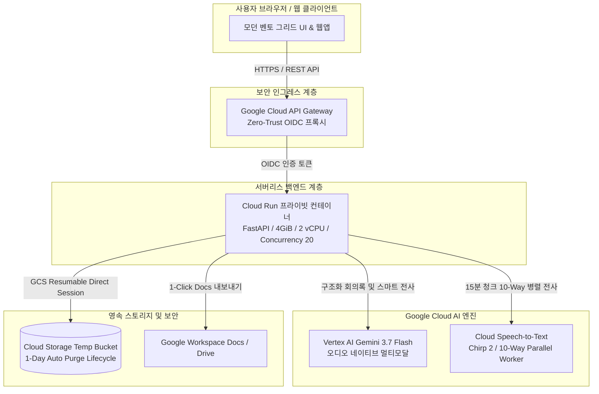

# 🏢 Enterprise AI Meeting Notes & Transcription Portal

> **Next-Generation Multimodal Enterprise Collaboration Platform**  
> **Powered by Google Cloud Vertex AI Gemini 3.7 Flash & Cloud Speech-to-Text (Chirp 2)**

---

## 🌟 개요 (Overview)

**Enterprise AI Meeting Notes Portal**은 대규모 엔터프라이즈 환경에서 진행되는 회의 녹음/녹화 미디어를 오디오 네이티브 멀티모달 AI로 심층 분석하여, **구조화 회의록(Executive Summary, Key Decisions, Action Items, Deep Agendas)과 화자 분리 대화록을 자동 생성**하고, **Google Cloud Speech-to-Text(Chirp 2) 음향 모델과의 실시간 성능/비용(TCO) 비교 분석**을 제공하는 차세대 기업용 AI 솔루션입니다.

---

## ✨ 핵심 기능 (Key Capabilities)

| 기능 분류 | 주요 내용 |
| :--- | :--- |
| **⚡ Fast-Path 초고속 회의록** | **Vertex AI Gemini 3.7 Flash**를 활용하여 대용량 오디오를 **완벽한 구조화 회의록으로 자동 생성** |
| **🎤 10-Way 병렬 Cloud STT** | 대용량 오디오를 15분 단위 청크로 분할하여 **10-Way 동시 병렬 전사** 수행 및 실시간 진행률(%) 표출 |
| **⚖️ 실시간 듀얼 엔진 비교** | Gemini 스마트 문맥 전사 vs Cloud STT 순수 음향 축어(Verbatim) 전사를 **좌우 분할 뷰(Side-by-Side)**로 나란히 비교 |
| **💰 TCO 비용 절감 분석** | 회의 2시간 기준 **Gemini ~160원 vs STT ~2,800원 (94.3% / 17.5배 비용 절감)** 지표 실시간 계산 |
| **👥 화자 지능형 일괄 치환** | 전사된 화자(예: 화자 1, 화자 2)를 실제 참석자 이름으로 **0ms 인메모리 지능형 일괄 치환** |
| **📄 1-Click Google Docs 연동** | 완성된 회의록을 사내 표준 Google Docs 문서로 즉시 생성 및 자동 공유 |
| **🔒 Zero-Retention 엔터프라이즈 보안** | GCS 임시 오디오 1일 자동 파기(Lifecycle Rule), 무인증 접근 차단 프라이빗 Cloud Run, API Gateway 연동 |

---

## 🏗️ 시스템 아키텍처 (Architecture)



---

## 🚀 배포 및 실행 가이드 (Deployment Options)

고객사 환경 및 운영 방식에 맞춰 가장 편리한 배포 방식을 선택할 수 있습니다:
* **방법 1 (추천)**: **클로드 코드 (Claude Code / AI Agent)**를 통한 10초 대화형 자동 배포
* **방법 2**: **원클릭 통합 배포 스크립트** (`quickstart.sh`)를 통한 일괄 배포
* **방법 3**: **3-Step 단계별 상세 순차 배포** (인프라 컴포넌트별 세부 제어)

---

### 📋 1. 사전 필수 요구사항 (Prerequisites)

배포 전 아래 환경 및 권한이 준비되어 있어야 합니다:
* **Python**: Python 3.10 이상 (Python 3.10 ~ 3.12 권장)
* **Google Cloud SDK (`gcloud`)**: 최신 버전 설치 및 콘솔 로그인
* **GCP 권한**: 배포 실행 계정에 대상 프로젝트의 다음 IAM 권한 필요:
  * `roles/run.admin` (Cloud Run 관리자)
  * `roles/apigateway.admin` (API Gateway 관리자)
  * `roles/iam.serviceAccountAdmin` & `roles/iam.serviceAccountUser` (서비스 계정 관리)
  * `roles/storage.admin` (GCS 버킷 및 수명주기 관리)
  * `roles/aiplatform.user` (Vertex AI Gemini 3.7 호출)
  * `roles/speech.client` (Cloud STT Chirp 2 호출)
  * `roles/cloudbuild.builds.editor` (컨테이너 이미지 빌드)
* **FFmpeg**: (선택: 로컬 미디어 분할 테스트용) `sudo apt-get install -y ffmpeg`

---

### 🐍 2. Python 가상화 환경(venv) 구성 및 패키지 설치

로컬 개발 및 테스트 시 패키지 충돌을 방지하기 위해 Python 가상환경을 먼저 생성하고 활성화합니다:

```bash
# 1. 프로젝트 디렉토리 이동
cd enterprise-collaborate-portal

# 2. Python 가상환경 생성 (.venv)
python3 -m venv .venv

# 3. 가상환경 활성화
source .venv/bin/activate
# Windows PowerShell의 경우: .\.venv\Scripts\Activate.ps1

# 4. pip 업그레이드 및 필수 의존성 패키지 일괄 설치
pip install --upgrade pip
pip install -r requirements.txt
```

---

### 🔑 3. Google Cloud 콘솔 계정 로그인 및 ADC 자격 증명 설정

Google Cloud API(Vertex AI, Cloud Speech, GCS, Cloud Run)를 호출하기 위해 사용자 계정으로 로그인하고 로컬 애플리케이션 기본 자격 증명(ADC)을 설정합니다:

```bash
# 1. gcloud CLI 사용자 계정 로그인
gcloud auth login

# 2. Application Default Credentials (ADC) 인증 설정 (로컬 백엔드 & 테스트 스위트용)
gcloud auth application-default login

# 3. 대상 GCP 프로젝트 설정
gcloud config set project YOUR_GCP_PROJECT_ID
```

---

### 🤖 4. 방법 1: 클로드 코드 (Claude Code / AI Agent) 전용 초간편 배포

터미널에서 **Claude Code CLI**를 사용하는 경우, 복잡한 인프라 명령어 입력 없이 대화 한 줄로 전체 배포를 완료할 수 있습니다.

#### 💬 Claude Code 실행 및 요청 프롬프트 예시
```bash
# 1. 프로젝트 폴더에서 claude 실행
cd enterprise-collaborate-portal
claude

# 2. Claude Code 대화창에 아래와 같이 요청:
> "현재 프로젝트를 GCP 프로젝트(YOUR_GCP_PROJECT_ID)의 us-central1 리전에 전체 배포해줘."
```

#### ⚙️ Claude Code가 내부적으로 자동 수행하는 작업:
1. 레포지토리 내 [`CLAUDE.md`](file:///usr/local/google/home/junghyunko/git/2026-AI/enterprise-collaborate-portal/CLAUDE.md) 아키텍처 가이드라인 자동 로드
2. `gcloud auth` 및 `.env` 설정 자동 감지 및 보정
3. `./deploy/quickstart.sh`를 실행하여 API 활성화 ➔ GCS 버킷 ➔ Cloud Run ➔ API Gateway 일괄 구축
4. 배포 완료 후 즉시 헬스체크를 수행하고 최종 접속 URL(`https://...gateway.dev`) 안내

---

### ⚡ 5. 방법 2: 원클릭 통합 배포 스크립트 (CLI One-Click)

터미널에서 스크립트 한 줄로 전체 인프라를 한 번에 자동 배포합니다:

```bash
# 문법: ./deploy/quickstart.sh [GCP_PROJECT_ID] [REGION]
./deploy/quickstart.sh YOUR_GCP_PROJECT_ID us-central1
```

* **소요 시간**: 약 3~5분 (GCP API Gateway 생성 시간 포함)
* **결과 출력**: 배포 완료 시 브라우저에서 바로 접속 가능한 Gateway 공용 URL이 출력됩니다.

---

### 🛠️ 6. 방법 3: 3-Step 상세 단계별 순차 배포 (Step-by-Step Manual)

각 인프라 컴포넌트를 단계별로 세부 제어하며 배포할 때 사용합니다.

#### Step 1. 고객 환경 초기화 (APIs, GCS 수명주기 버킷, .env 자동 구성)
```bash
./deploy/setup_customer_environment.sh YOUR_GCP_PROJECT_ID us-central1
```
* **상세 동작**:
  * 8대 필수 GCP API(`run`, `apigateway`, `aiplatform`, `speech`, `storage`, `cloudbuild` 등) 자동 활성화
  * 임시 오디오 버킷(`gs://[PROJECT_ID]-meet-audio-temp`) 생성 및 **1일 자동 파기(Lifecycle Rule)** 규칙 적용
  * `.env` 환경설정 파일 자동 생성

#### Step 2. Cloud Run 프라이빗 백엔드 배포
```bash
./deploy/deploy_backend.sh YOUR_GCP_PROJECT_ID us-central1
```
* **상세 동작**:
  * Cloud Build를 통해 FFmpeg 오디오 엔진이 포함된 컨테이너 이미지 자동 빌드
  * 프라이빗 Cloud Run(`--no-allow-unauthenticated`, 2 vCPU, 4GiB 메모리, Concurrency 20, 1~20 자동 스케일아웃) 배포
  * Vertex AI Gemini 3.7 Flash 모델 및 임시 GCS 버킷 환경변수 바인딩

#### Step 3. Google Cloud API Gateway 배포 및 라우팅 연동
```bash
./deploy/deploy_gateway.sh YOUR_GCP_PROJECT_ID us-central1
```
* **상세 동작**:
  * API Gateway 전용 인그레스 서비스 계정(`agent-gateway-sa`) 생성 및 Cloud Run Invoker IAM 권한 부여
  * `deploy/openapi2-agentgateway.yaml` 라우팅 명세를 기반으로 API Config 생성 및 Gateway 롤아웃
  * 배포 완료 후 외부에서 브라우저로 접근 가능한 공용 URL(`https://YOUR_GATEWAY.gateway.dev`) 출력

---

### ⚙️ 7. 환경설정 변수 레퍼런스 (.env)

| 환경변수명 | 기본값 / 예시 | 설명 |
| :--- | :--- | :--- |
| `GCP_PROJECT_ID` | `your-gcp-project-id` | 대상 Google Cloud 프로젝트 ID |
| `GCP_LOCATION` | `global` | Vertex AI Gemini 3.7 모델 리전 |
| `TEMP_GCS_BUCKET` | `[PROJECT_ID]-meet-audio-temp` | 대용량 오디오 임시 저장 및 Zero-Transfer용 GCS 버킷 |
| `GEMINI_MODEL_NAME` | `gemini-3.7-flash` | 사용 멀티모달 파운데이션 모델명 |
| `LOCAL_API_SERVER_URL`| `http://localhost:9090` | 로컬 개발 서버 URL |

---

## 🧪 자체 진단 및 테스트 (Testing & Verification)

```bash
# 1. 종합 단위 테스트 5종 전수 검증 (100% Pass)
python3 tests/06_comprehensive_unit_test.py

# 2. Google Cloud API Gateway 14개 엔드포인트 E2E 자동 검증
python3 scripts/test_external_gateway.py https://YOUR_GATEWAY.gateway.dev

# 3. 실전 미디어 파이프라인 E2E 검증 (업로드 ➔ Gemini ➔ Cloud STT 전사 ➔ 품질 검증)
python3 scripts/test_input_media.py

# 4. 회의록 보관함 및 비동기 STT 진행률 실시간 진단 CLI
./scripts/check_report.sh [리포트ID 또는 검색어]

# 5. 로컬 개발 서버 구동 (포트 9090)
./run_server.sh
```

---

## 📂 프로젝트 디렉토리 구조

```text
enterprise-collaborate-portal/
├── app/
│   ├── main.py                  # FastAPI 엔드포인트 및 오케스트레이션
│   ├── core/                    # 설정, 무지연 ADC 인증, 로깅
│   ├── models/                  # Pydantic 스키마 정의
│   ├── services/
│   │   ├── gemini_service.py    # Vertex AI Gemini 3.7 Flash 회의록 엔진
│   │   ├── stt_service.py       # Cloud STT 10-Way 병렬 전사 및 디토크나이저
│   │   ├── audio_service.py     # FFmpeg 청크 분할 및 오디오 변환
│   │   ├── speaker_service.py   # 화자 지능형 일괄 치환 엔진
│   │   └── storage_service.py   # GCS Direct Resumable Upload
│   └── templates/               # CFT 정기회의, 킥오프, 임원보고 템플릿
├── deploy/
│   ├── setup_customer_environment.sh  # 고객 환경 원클릭 초기화 스크립트
│   ├── deploy_backend.sh              # Cloud Run 배포 스크립트
│   ├── deploy_gateway.sh              # API Gateway 배포 스크립트
│   └── openapi2-agentgateway.yaml     # OpenAPI 2.0 게이트웨이 라우팅 명세
├── static/                      # 모던 벤토 그리드 반응형 웹 인터페이스 (HTML/CSS/JS)
├── data/
│   ├── templates/               # 회의록 프롬프트 템플릿 JSON
│   └── samples/                 # 표준 샘플 회의록 및 마크다운 자료
└── tests/                       # 종합 단위 및 E2E 테스트 스위트
```

---

## 🔒 보안 및 컴플라이언스 (Security & Compliance)

* **비인가 접근 차단 (Zero-Trust)**: Cloud Run 백엔드는 외부 직접 접속이 차단(`--no-allow-unauthenticated`)되어 있으며, API Gateway의 서비스 계정 OIDC 토큰을 통해서만 접근할 수 있습니다.
* **데이터 무단 잔류 방지 (Zero Retention)**: GCS 버킷에 업로드된 미디어 파일은 1일 후 자동 영구 삭제(Auto Lifecycle Rule)되며, 전사 처리에 사용된 임시 청크는 처리 즉시 삭제됩니다.
