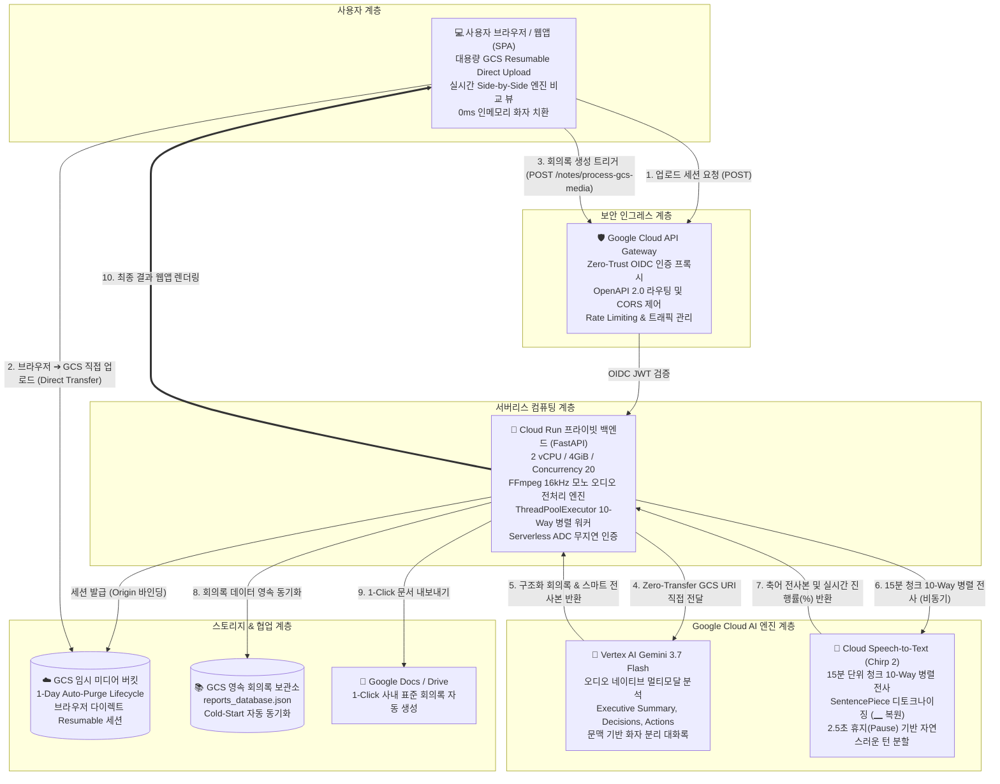

# 🏗️ 01. Enterprise AI 협업포털 시스템 아키텍처 (System Architecture)

> **Next-Generation Multimodal Enterprise Collaboration Platform**  
> **Google Cloud Vertex AI Gemini 3.7 Flash & Cloud Speech-to-Text (Chirp 2)**

---

## 1. 개요 및 설계 목표 (System Objectives)

Enterprise AI 협업포털은 대규모 기업 환경에서 진행되는 회의 녹음/녹화 미디어를 오디오 네이티브 멀티모달 AI로 분석하여 **구조화 회의록과 화자 분리 전사본을 자동 생성**하고, **Google Cloud Speech-to-Text(Chirp 2) 음향 모델과의 실시간 성능/비용(TCO) 비교 분석**을 제공하는 차세대 솔루션입니다.

### 🌟 핵심 설계 원칙
1. **Zero-Transfer 초고속 처리**: 브라우저에서 GCS로 다이렉트 Resumable Upload 후, Vertex AI Gemini 3.7 Flash에 GCS URI(`gs://...`)를 직접 전달하여 추가 다운로드/업로드 병목 없이 즉시 추론합니다.
2. **하이브리드 듀얼 엔진 아키텍처**:
   * **Fast-Path**: Gemini 3.7 Flash를 통한 초고속 회의록 및 스마트 문맥 대화록 생성
   * **비동기 10-Way 병렬 Cloud STT**: 15분 단위 청크 병렬 전사를 통한 100% 무가공 축어(Verbatim) 음향 모델 전사
3. **Zero-Trust 보안**: Cloud Run 백엔드는 외부 직접 접근이 차단(`--no-allow-unauthenticated`)되어 있으며, Google Cloud API Gateway의 전용 OIDC 서비스 계정을 통해서만 호출됩니다.
4. **Zero-Retention 데이터 보호**: GCS 임시 버킷의 오디오는 1일 수명주기(Lifecycle Rule)를 통해 자동 파기되며, 분석용 임시 청크는 처리 즉시 메모리/디스크에서 삭제됩니다.

---

## 2. 전체 시스템 아키텍처 다이어그램

---

## 3. 핵심 모듈별 상세 설계 (Core Components)

### 3.1. Vertex AI Gemini 3.7 Flash 회의록 엔진 (`gemini_service.py`)
* **오디오 네이티브 추론**: 텍스트로 변환 후 요약하는 2단계 방식이 아닌, 오디오 음향 신호를 직접 입력받아 뉘앙스, 억양, 어조를 종합 판단하여 요약 품질 극대화.
* **출력 구조화**:
  1. `Executive Summary`: 3~5문장의 명확한 요약
  2. `Key Decisions`: 결정된 정책 및 합의 사항
  3. `Agenda Discussions`: 안건별 발언자, 배경, 세부 논의, 결론
  4. `Action Items`: 작업 내용, 담당자, 마감일, 상태
  5. `Smart Transcript`: 타임스탬프(`[HH:MM:SS]`) 기반 화자별 발화록

### 3.2. Cloud Speech-to-Text (Chirp 2) 10-Way 병렬 엔진 (`stt_service.py`)
* **15분 청크 분할**: 긴 회의 녹음(예: 2시간)을 15분 단위 청크로 분할하여 `ThreadPoolExecutor(max_workers=10)`로 동시 병렬 요청.
* **Chirp 2 디토크나이징 (`_clean_stt_tokens`)**: Google Chirp 모델의 SentencePiece 서브워드 토큰(`\u2581`, `▁`)을 자연스러운 한국어 어절과 조사로 완벽 복원.
* **지능형 발화 턴 분할**: 2.5초 이상 무음(Pause) 및 문장 종결 어미를 감지하여 15분 블록을 수십 개의 자연스러운 대화 턴으로 자동 분할.

### 3.3. Zero-Trust API Gateway (`openapi2-agentgateway.yaml`)
* **인증 분리**: 외부 클라이언트는 API Gateway의 엔드포인트를 통해 통신하며, 백엔드 Cloud Run URL은 외부에 노출되지 않음.
* **페이로드 우회**: 대용량 미디어 업로드는 GCS Resumable Upload 세션으로 게이트웨이를 바이패스하여 32MB 페이로드 제한을 근본적으로 해결.

### 3.4. GCS 영속 데이터베이스 동기화 (`storage_service.py`, `main.py`)
* Cloud Run 컨테이너 재시작(Cold Start) 시 GCS 버킷의 `metadata/reports_database.json`을 자동으로 다운로드하여 로컬 캐시를 100% 복구함으로써 무중단 영속 보관 지원.
