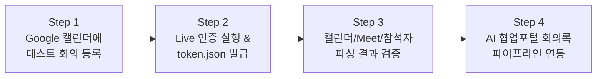

# 📋 Google Calendar API v3 단계별 실전 테스트 가이드 (Google Workspace 계정 기준)

> **대상 계정**: `admin@company.com`  
> **대상 프로젝트**: `your-gcp-project-id` (GCP)  
> **목적**: 사내 보안 정책(CAA) 제약 없이 100% 안전하게 Google Calendar API와 Google Meet을 연동하여 회의 일정, 참석자 명단, Meet 화상회의 코드를 수집하고 AI 회의록 파이프라인에 연결합니다.

---

## 📌 전체 진행 순서 요약 (4 Steps)



---

## 1️⃣ Step 1: Google 캘린더에 테스트 회의 등록 (1분)

1. 웹 브라우저에서 **[Google Calendar](https://calendar.google.com)**에 접속합니다.
   * *반드시 **`admin@company.com`** 계정으로 로그인되어 있는지 확인합니다.*
2. 오늘 또는 내일 날짜에 **`[+ 만들기]` ➔ `[이벤트]`**를 클릭합니다.
3. 아래 정보를 입력하고 저장합니다:
   * **제목**: `리테일 회사 AI 협업포털 회의록 자동화 기술 미팅`
   * **화상 회의**: **`[Google Meet 화상 회의 추가]`** 버튼 클릭 (중요 ⭐)
   * **참석자 추가**: 
     - `ce@google.com`
     - `hong@example.com`
     - `sung@example.com`
   * **설명**: `Google Meet 녹화본과 Vertex AI Gemini 3.7 Flash를 활용한 다중 화자 분리 및 실시간 전사 회의록 자동화 아키텍처 검토`
4. **`[저장]`**을 클릭합니다.

---

## 2️⃣ Step 2: Live 모드 실행 및 OAuth 인증 완료

1. 터미널(프로젝트 루트 디렉토리)에서 아래 명령어를 실행합니다:
   ```bash
   cd enterprise-collaborate-portal
   .venv/bin/python gg_calendar/test_calendar_api.py --mode live
   ```
2. 자동으로 브라우저에 **Google 로그인 창**이 열립니다.
3. **`admin@company.com`** 계정을 선택합니다.
4. **"Enterprise-Meet-AI-Portal에서 Google 계정에 액세스하려고 합니다"** 동의 화면에서 **`[계속]`** 및 **`[허용(Allow)]`**을 클릭합니다.
5. 브라우저에 `"The authentication flow has completed. You may close this tab."` 메시지가 뜨면 인증 완료!
6. 프로젝트 루트에 **`token.json`** 파일이 자동 생성됩니다.

---

## 3️⃣ Step 3: 터미널에서 캘린더 및 Meet 링크 파싱 검증

인증이 완료되면 터미널에 방금 생성한 회의 일정이 아래와 같이 자동으로 출력됩니다:

```text
======================================================================
🌐 [2단계: Google Calendar API v3 라이브 계정 연동 테스트 시작]
======================================================================
✅ 인증 성공! 토큰 저장: /.../collaborate-portal/token.json

📅 [Google Calendar] 다가오는 10개 회의 일정 조회 중...
총 1개의 일정을 발견했습니다:

• 📌 [2026-08-19T15:00:00+09:00] 리테일 회사 AI 협업포털 회의록 자동화 기술 미팅
   - Meet 링크: https://meet.google.com/xxx-yyyy-zzz
   - 참석자 (4명): admin@company.com, ce@google.com, hong@example.com 외
```

---

## 4️⃣ Step 4: AI 협업포털 회의록 파이프라인 연계

Calendar API로 수집된 데이터는 아래와 같이 포털에 즉시 주입됩니다:

| Calendar API 수집 항목 | 포털 활용 필드 | 활용 목적 |
| :--- | :--- | :--- |
| `event.summary` | 회의 제목 (`#meetingTitle`) | AI 회의록 상단 제목 자동 세팅 |
| `event.attendees` | 참석자 명단 (`#attendees`) | **Gemini 3.7 화자 분리(Diarization) 프롬프트에 참석자 명단 자동 주입** |
| `event.hangoutLink` | Google Meet 회의 코드 | **Meet API v2(`conferenceRecords`)를 호출하여 녹화본 자동 다운로드** |
| `event.start / end` | 회의 일시 메타 배너 | 회의록 1페이지 상단 메타데이터 표기 |

---

## 💡 유용한 추가 명령어

* **오프라인 Mock 모의 테스트 (네트워크/인증 없이 즉시 실행)**:
  ```bash
  .venv/bin/python gg_calendar/test_calendar_api.py --mode mock
  ```
* **인증 토큰 초기화 후 재인증이 필요한 경우**:
  ```bash
  rm -f token.json
  .venv/bin/python gg_calendar/test_calendar_api.py --mode live
  ```
