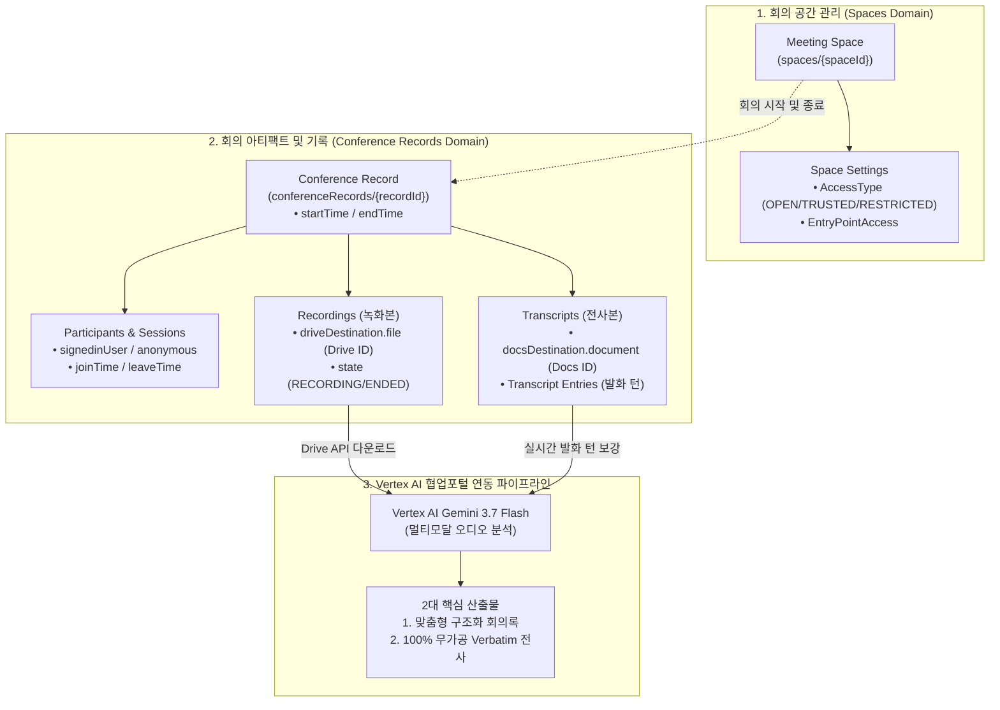

# 📹 Google Meet REST API v2 종합 개발 및 연동 가이드

- **공식 레퍼런스**: [Google Meet API REST v2 (한국어)](https://developers.google.com/workspace/meet/api/reference/rest/v2?hl=ko)
- **고객 맞춤형 실전 가이드**: 👉 **[MEET_API_USER_GUIDE.md](./MEET_API_USER_GUIDE.md)**
- **API 기본 엔드포인트**: `https://meet.googleapis.com/v2`
- **공식 Python SDK**: `google-apps-meet` (`google.apps.meet_v2`)
- **작성 일자**: 2026-08-19

---

## 📌 1. Google Meet API v2 개요 및 핵심 기능

Google Meet REST API v2는 회의 공간(Space) 생성 및 관리, 진행 중 또는 종료된 회의의 세부 메타데이터(`conferenceRecords`), 참가자 접속 이력(`participants`), 클라우드 녹화본(`recordings`), 실시간 음성 전사본(`transcripts` 및 `entries`)에 프로그래밍 방식으로 접근할 수 있는 최신 엔터프라이즈 API입니다.



---

## 🔑 2. OAuth 2.0 인증 및 권한 범위 (Scopes)

Google Meet API v2는 세분화된 보안 Scope를 제공합니다:

| 권한 Scope URI | 설명 | 필요 작업 |
| :--- | :--- | :--- |
| `https://www.googleapis.com/auth/meetings.space.created` | 본 앱이 생성한 회의 공간(Space) 생성 및 관리 | 신규 회의방 생성 (`create_space`) |
| `https://www.googleapis.com/auth/meetings.space.readonly` | 회의 공간 정보 읽기 전용 조회 | 공간 메타데이터 조회 (`get_space`) |
| `https://www.googleapis.com/auth/meetings.space.settings` | 회의 공간 정책 및 접근 제어 설정 | 입장 방식 및 보안 설정 변경 |
| `https://www.googleapis.com/auth/meetings.conference.media.readonly` | 회의 녹화본 및 아티팩트 메타데이터 읽기 | 녹화본 목록 및 Drive ID 조회 |
| `https://www.googleapis.com/auth/meetings.conference.recordings.readonly` | 회의 녹화본 메타데이터 읽기 전용 | 녹화본 상태 조회 (`list_recordings`) |
| `https://www.googleapis.com/auth/meetings.conference.transcripts.readonly` | 회의 실시간 전사본 및 발화 턴 읽기 | 발화 턴 조회 (`list_transcript_entries`) |
| `https://www.googleapis.com/auth/drive.readonly` *(연계 필수)* | Google Drive 녹화본 비디오(`.mp4`) 다운로드 | 오디오 추출 및 Vertex AI 입력 |

---

## 📚 3. 리소스 계층 구조 및 주요 API 엔드포인트

### 3-1. 회의 공간 서비스 (`SpacesService`)
* **`POST /v2/spaces`**: 새 회의 공간 생성 (고유 회의 링크 `meetingUri` 및 회의 코드 `meetingCode` 발급).
* **`GET /v2/spaces/{spaceId}`**: 특정 회의 공간 정보 조회.
* **`PATCH /v2/spaces/{spaceId}`**: 회의 공간 설정(입장 권한, 녹화 허용 여부 등) 업데이트.
* **`POST /v2/spaces/{spaceId}:endActiveConference`**: 현재 활성 회의 즉시 종료.

### 3-2. 회의 기록 및 아티팩트 서비스 (`ConferenceRecordsService`)
* **`GET /v2/conferenceRecords`**: 회의 기록 목록 조회 (특정 `space` 또는 기간별 필터링 지원).
* **`GET /v2/conferenceRecords/{recordId}`**: 특정 회의 상세 기록(시작/종료 시각, 연결된 공간) 조회.
* **`GET /v2/conferenceRecords/{recordId}/participants`**: 회의 참석자 목록 및 사용자 ID 조회.
* **`GET /v2/conferenceRecords/{recordId}/participants/{participantId}/participantSessions`**: 참가자별 세션(입장/퇴장 시각).
* **`GET /v2/conferenceRecords/{recordId}/recordings`**: **Google Meet 비디오 녹화본 메타데이터 조회 (`driveDestination.file`을 통해 Drive 파일 ID 획득)**.
* **`GET /v2/conferenceRecords/{recordId}/transcripts`**: Meet 실시간 자동 전사본 메타데이터 조회 (`docsDestination.document`를 통해 Google Docs 파일 ID 획득).
* **`GET /v2/conferenceRecords/{recordId}/transcripts/{transcriptId}/entries`**: **발화자별 세부 대화 턴 목록 조회 (`startTime`, `endTime`, `participant`, `text`, `languageCode`)**.

---

## 💻 4. Python SDK 사용법 (`google-apps-meet`)

### 4-1. 라이브러리 설치
```bash
pip install google-apps-meet google-auth google-auth-oauthlib google-api-python-client
```

### 4-2. 회의 공간(Space) 생성 예제
```python
from google.apps import meet_v2
from google.oauth2.credentials import Credentials

# OAuth 2.0 Credentials 준비
creds = Credentials.from_authorized_user_file("token.json")

# Spaces Client 초기화
client = meet_v2.SpacesServiceClient(credentials=creds)

# 회의 공간 생성 요청
request = meet_v2.CreateSpaceRequest(
    space=meet_v2.Space(
        config=meet_v2.SpaceConfig(
            access_type=meet_v2.SpaceConfig.AccessType.OPEN
        )
    )
)
space = client.create_space(request=request)
print(f"✅ 회의 공간 생성 완료!")
print(f"- Space Name: {space.name}")
print(f"- Meeting URI: {space.meeting_uri}")
print(f"- Meeting Code: {space.meeting_code}")
```

### 4-3. 회의 녹화본 Drive 파일 ID 및 전사본 턴 추출 예제
```python
from google.apps import meet_v2
from google.oauth2.credentials import Credentials

creds = Credentials.from_authorized_user_file("token.json")
conf_client = meet_v2.ConferenceRecordsServiceClient(credentials=creds)

# 1. 최근 회의 기록 목록 조회
records = conf_client.list_conference_records(request=meet_v2.ListConferenceRecordsRequest(page_size=5))

for record in records:
    print(f"\n📁 [회의 기록] {record.name} ({record.start_time} ~ {record.end_time})")
    
    # 2. 녹화본(Recordings) 조회 및 Drive File ID 추출
    recordings = conf_client.list_recordings(parent=record.name)
    for rec in recordings:
        print(f"  🎬 녹화본 상태: {rec.state.name}")
        if rec.drive_destination:
            print(f"     • Google Drive File ID: {rec.drive_destination.file}")
            print(f"     • Drive URL: {rec.drive_destination.export_uri}")
            
    # 3. 전사본(Transcripts) 및 세부 발화 턴 조회
    transcripts = conf_client.list_transcripts(parent=record.name)
    for tr in transcripts:
        print(f"  📄 전사본 문서 ID: {tr.docs_destination.document if tr.docs_destination else 'N/A'}")
        
        # 세부 턴(Entries) 목록 조회
        entries = conf_client.list_transcript_entries(parent=tr.name)
        for entry in entries:
            print(f"     [{entry.start_time}] {entry.participant}: {entry.text}")
```

---

## 🔄 5. 코웨이 협업포털 AI 회의록 시스템과의 결합 워크플로우

1. **자동 감지**: 사용자가 Google Calendar 또는 Google Meet에서 회의를 진행하고 녹화를 종료.
2. **API 연동**: `ConferenceRecordsServiceClient.list_recordings()`를 호출하여 `driveDestination.file` 획득.
3. **오디오 트랜스코딩**: Google Drive API로 녹화본 다운로드 후 `ffmpeg`를 통해 16kHz 모노 MP3/WAV 고속 추출.
4. **Vertex AI Gemini 3.7 Flash 처리**:
   - `gemini_service.generate_notes()`: 3대 맞춤형 템플릿(CFT/Kickoff/Executive) 기반 구조화 회의록 생성.
   - `gemini_service.generate_transcript()`: 100% 무가공 Verbatim 다중 화자 분리 스크립트 복원.
5. **포털 제공 및 Docs 배포**: Web UI 서빙 및 Google Docs 자동 생성 저장.