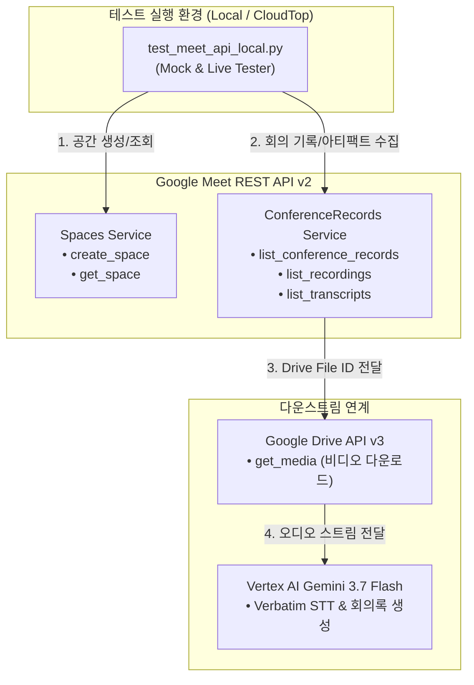

# 🧪 Google Meet REST API v2 실전 테스트 계획서 (Test Plan)

- **문서 버전**: v1.0
- **테스트 대상**: Google Meet REST API v2 (`spaces`, `conferenceRecords`, `recordings`, `transcripts`)
- **연계 대상**: Google Drive API v3, Vertex AI Gemini 3.7 Flash, FastAPI Collaborate Portal
- **작성 일자**: 2026-08-19

---

## 🎯 1. 테스트 목적 및 범위

### 1-1. 테스트 목적
본 계획서는 Google Meet REST API v2를 활용하여 회의 공간 동적 생성부터 회의 종료 후 생성되는 아티팩트(녹화본 Drive ID, 참가자 이력, 실시간 전사 발화 턴)를 안전하게 수집하고, 이를 협업포털 AI 파이프라인(Vertex AI Gemini 3.7 Flash)과 엔드투엔드로 연동하기 위한 테스트 시나리오 및 검증 기준을 정의합니다.

### 1-2. 테스트 범위
1. **회의 공간(Space) 관리 검증**: 공간 생성(`create_space`), 상세 조회(`get_space`), 설정 변경(`update_space`), 회의 강제 종료(`end_active_conference`).
2. **회의 기록(`conferenceRecords`) 수집 검증**: 최근 회의 이력 조회, 시작/종료 시각 파싱.
3. **참가자(`participants`) 및 세션 추적**: 참가자 식별(이메일/익명), 입장/퇴장 시각 및 접속 지속 시간.
4. **녹화본(`recordings`) 및 Drive 연동 검증**: 녹화본 상태(`ENDED`/`FILE_GENERATED`) 및 `driveDestination.file` (Google Drive File ID) 추출.
5. **Meet 전사본(`transcripts` & `entries`) 검증**: 실시간 전사 발화 턴(`speaker`, `startTime`, `endTime`, `text`) 수집.
6. **E2E 통합 파이프라인 검증**: Meet API ➔ Drive 녹화본 추출 ➔ Vertex AI 전사/회의록 생성 ➔ 포털 서빙.

---

## 🏗️ 2. 테스트 환경 및 아키텍처



---

## 📋 3. 세부 테스트 시나리오 및 테스트 케이스

| TC ID | 테스트 시나리오 | 테스트 메서드 / 요청 | 입력 데이터 | 기대 결과 (Expected Outcome) |
| :---: | :--- | :--- | :--- | :--- |
| **TC-01** | **신규 회의 공간(Space) 생성** | `SpacesService.create_space` | `access_type=OPEN` | `name` (`spaces/*`), 유효한 `meeting_uri` (`https://meet.google.com/xxx-yyyy-zzz`), `meeting_code` 발급 |
| **TC-02** | **회의 공간 상세 조회** | `SpacesService.get_space` | `name="spaces/{spaceId}"` | 해당 공간의 메타데이터 및 구성 설정 일치 확인 |
| **TC-03** | **회의 공간 정책 변경** | `SpacesService.update_space` | `access_type=RESTRICTED` | 업데이트된 정책 반영 및 반환 |
| **TC-04** | **회의 기록(ConferenceRecords) 목록 조회** | `ConferenceRecordsService.list_conference_records` | `page_size=5` | 최근 회의 기록 리스트, 시작 시각(`start_time`), 종료 시각(`end_time`) 파싱 |
| **TC-05** | **회의 참가자 및 세션 이력 조회** | `ConferenceRecordsService.list_participants` | `parent="conferenceRecords/*"` | 참가자 목록, `signedin_user` 또는 `anonymous_user` 식별, 세션 접속 구간 반환 |
| **TC-06** | **회의 녹화본 메타데이터 & Drive ID 추출** | `ConferenceRecordsService.list_recordings` | `parent="conferenceRecords/*"` | `state=RECORDING_STATE_UNSPECIFIED` 이상, `drive_destination.file` (Drive File ID) 정상 추출 |
| **TC-07** | **Meet 전사본 및 발화 턴(Entries) 추출** | `ConferenceRecordsService.list_transcript_entries` | `parent="conferenceRecords/*/transcripts/*"` | 타임스탬프, 발화자, 텍스트가 포함된 `TranscriptEntry` 리스트 반환 |
| **TC-08** | **오프라인/로컬 Mock 테스트** | `LocalMeetSimulator` | 더미 회의 메타데이터 | 네트워크/인증 없이도 전체 데이터 모델 및 비즈니스 로직 100% 검증 |

---

## 🚀 4. 테스트 실행 절차

### 4-1. 1단계: 로컬 단위 및 모의(Mock) 테스트 실행
인증 자격증명 없이도 Meet API 응답 데이터 모델, 파싱 로직, Drive ID 추출 파이프라인의 무결성을 즉시 검증합니다.
```bash
python gg_meet/test_meet_api_local.py --mode mock
```

### 4-2. 2단계: 사내 라이브 Google Meet API 연동 테스트
OAuth 2.0 사용자 토큰(`token.json`) 또는 서비스 계정을 통해 실제 Google Meet v2 API 엔드포인트와 통신하여 실측 데이터를 검증합니다.
```bash
python gg_meet/test_meet_api_local.py --mode live
```

---

## ⚠️ 5. 예외 상황 및 오류 대응 계획 (Troubleshooting)

1. **`PERMISSION_DENIED` (403)**:
   - 원인: 필수 Scope 누락 (`meetings.space.created`, `meetings.conference.media.readonly` 등).
   - 조치: `AuthService`의 `SCOPES` 목록에 Meet 관련 Scope 추가 후 `token.json` 재생성.
2. **`NOT_FOUND` (404)**:
   - 원인: 잘못된 `spaceId` 또는 아직 회의 기록(`conferenceRecord`)이 생성되지 않은 상태.
   - 조치: 회의 종료 후 약 1~2분 뒤 아티팩트 생성 완료 시점에 재조회(Exponential Backoff 재시도 적용).
3. **`RECORDING_NOT_READY`**:
   - 원인: 회의 녹화본이 Google Drive에 인코딩/업로드 처리 중인 상태.
   - 조치: `rec.state == Recording.State.FILE_GENERATED` 상태 폴링 또는 Cloud Tasks 비동기 큐 연동.
